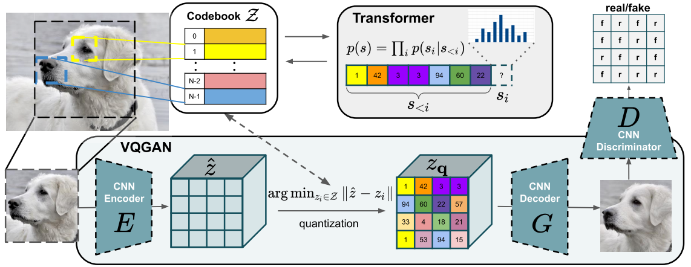

# VQGAN_from_scratch

## Introduction

Pytorch版本实现的VQ-GAN第一个阶段(仅供学习)

## Preliminary

- **VQGAN-architecture**



- **VQGAN介绍**

VQ-GAN是一种生成模型, 主要用于图像建模。它是一个两阶段的模型, 第一阶段是**自编码器和向量量化**, 第二阶段是**基于Transformer的潜在空间建模**。

第一阶段类似于VQ-VAE的训练, 主要目的是通过**基于CNN的编码器-量化-解码器**三步将图像压缩到离散的表示空间, 然后再解码回原始图像。第一阶段训练的目标是最小化图像重建的损失, 通常会用到重建误差以及codebook更新的损失。与VQ-VAE不同的是, VQ-GAN在这一过程中还会用到感知损失(Perceptual Loss)和对抗损失(Adversarial Loss)来进一步提高生成图像的质量。在第二个阶段中, VQ-GAN使用Transformer对离散token序列进行建模, 学习生成新的token序列, 最终通过解码器生成新图像。

## Acknowledgements

- [Taming Transformers for High-Resolution Image Synthesis](https://arxiv.org/abs/2012.09841)
- [Designing a Better Asymmetric VQGAN for StableDiffusion](https://arxiv.org/abs/2306.04632)
- [VQGAN+Transformer自回归建模图像生成的论文原理细致讲解](https://www.bilibili.com/video/BV1mh411g7r5/?spm_id_from=333.788&vd_source=634f9cd56b5b0cf10f6976238630bd8d)
- [VQGAN-pytorch](https://github.com/dome272/VQGAN-pytorch)
- [VQGAN-pytorch-fixed-version](https://github.com/aa1234241/vqgan)
- [vector-quantize-pytorch](https://github.com/lucidrains/vector-quantize-pytorch)
- [Training an VQGAN VAE in diffusers](https://github.com/huggingface/diffusers/blob/3159e60d59819ae874ea3cdbd28e02d9e6c57321/examples/vqgan/README.md)

## Citation
```bibtex
@misc{esser2021taming,
      title={Taming Transformers for High-Resolution Image Synthesis}, 
      author={Patrick Esser and Robin Rombach and Björn Ommer},
      year={2021},
      eprint={2012.09841},
      archivePrefix={arXiv},
      primaryClass={cs.CV}
}
```